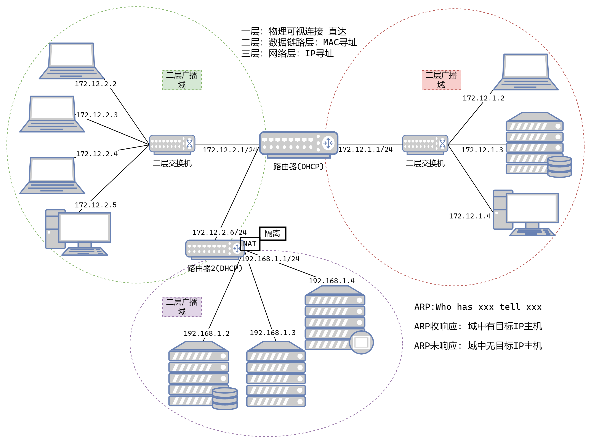
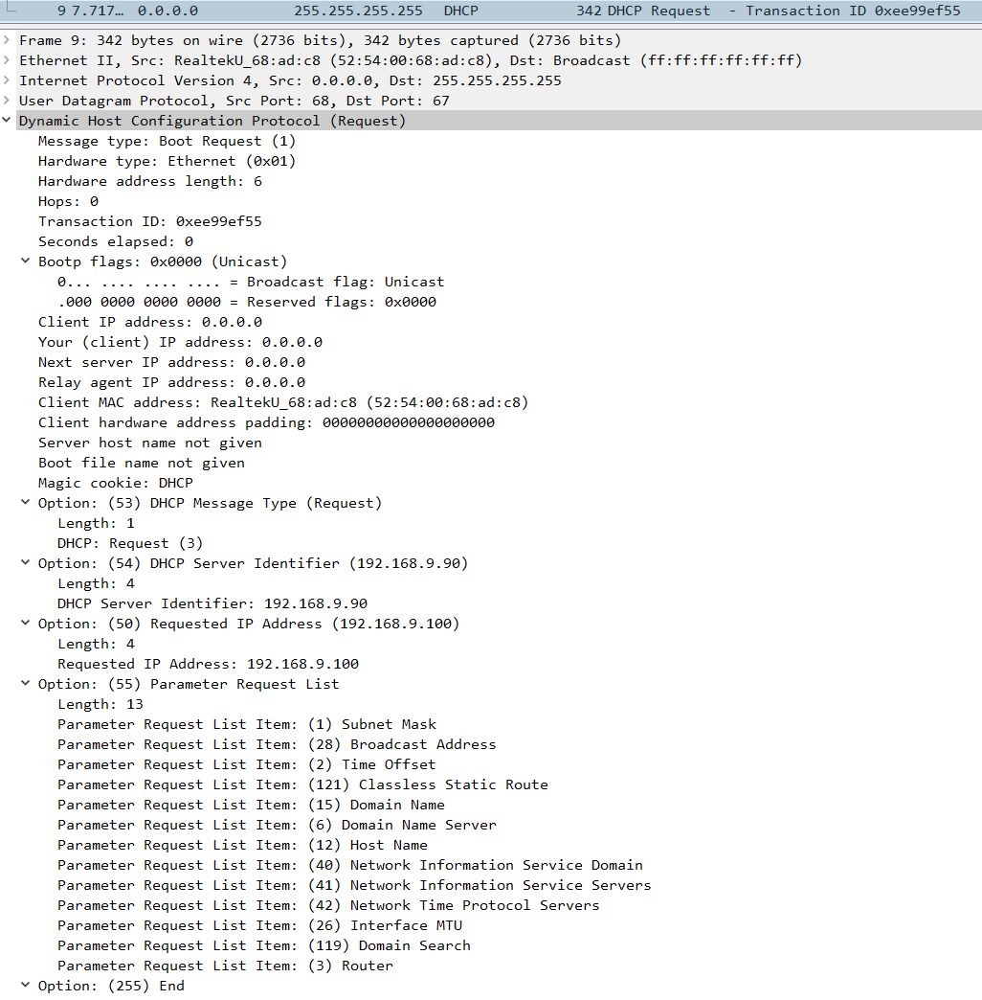

## 一、广播域和实验拓扑

**二层广播域**


**实验网络拓扑**


[**抓包文件**](ref/DHCP+ARP+DNS.pcap)

## 二、ARP协议

**ARP协议介绍**

ARP（Address Resolution Protocol）协议主要用于在同一个局域网内通过IP地址获取MAC地址，或通过MAC地址反查IP地址。ARP协议主要有两种类型的消息：

- **ARP请求（ARP Request）**：当主机需要知道另一个主机的MAC地址时，会发送ARP请求消息。这个广播帧包含目标主机的IP地址和发送方的IP地址与MAC地址。网络上的所有主机都会收到此广播，但只有拥有目标IP地址的主机才会回应。
	
- **ARP响应（ARP Reply）**：收到ARP请求的主机如果其IP地址与ARP请求中的目标IP地址相匹配，则会发送一个单播的ARP响应消息。ARP响应中包含了该主机的IP地址与其对应的MAC地址。
	
总结来说，ARP协议的核心操作就是ARP请求和ARP应答这两种消息类型，它们共同完成网络层IP地址向数据链路层MAC地址的转换过程。

## 三、DHCP服务器

**DHCP协议介绍**

DHCP（Dynamic Host Configuration Protocol，动态主机配置协议）使用UDP协议工作，采用67（DHCP服务器）和68（DHCP客户端）两个端口号。DHCP一共有8种消息类型，这些消息类型在DHCP协议中用于不同的目的和场景。以下是DHCP协议的8种消息类型：

- **Discover**：当DHCP客户端启动时，它会广播一个Discover报文，以寻找网络上的DHCP服务器。这是DHCP过程的开始。
	
- **Offer**：DHCP服务器收到Discover报文后，会查找可用的IP地址，并构造一个Offer报文发送给DHCP客户端，告知客户端它可以提供该IP地址。
	
- **Request**：DHCP客户端从接收到的多个Offer中选择一个，并发送一个Request报文给所选的DHCP服务器，请求分配该IP地址。如果客户端之前已经分配了IP地址，并且在租期过去一半时，它会发送单播Request报文来续延租期。
	
- **ACK**：DHCP服务器收到Request报文后，会检查请求的有效性，并发送一个ACK报文作为回应，确认IP地址的分配。
	
- **NAK**：如果DHCP服务器无法分配IP地址（例如，由于租约记录不存在或IP地址池已耗尽），它会发送一个NAK报文作为回应，通知客户端无法分配IP地址。
- **Release**：当DHCP客户端不再需要使用分配的IP地址时（例如，客户端关机或下线），它会发送一个Release报文给DHCP服务器，请求释放该IP地址。
- **Decline**：如果DHCP客户端通过地址冲突检测发现服务器分配的IP地址冲突或由于其他原因无法使用，它会发送一个Decline报文给DHCP服务器，请求分配一个新的IP地址。
- **Inform**：DHCP客户端可以使用Inform报文向DHCP服务器请求配置参数，而不需要重新分配IP地址。这通常用于已经拥有IP地址的客户端，但需要更新其他配置信息（如DNS服务器地址）。

这些消息类型共同构成了DHCP协议的工作流程，使得DHCP客户端能够自动获取网络配置信息，如IP地址、子网掩码、默认网关和DNS服务器地址等。

**安装和操作**

```shell
yum install dhcp
systemctl status dhcpd

vim /etc/dhcp/dhcpd.conf
cat > /etc/dhcp/dhcpd.conf << EOF
subnet 192.168.9.0 netmask 255.255.255.0 {
	range 192.168.9.100 192.168.9.200;
	option routers 192.168.9.1;
	option domain-name-servers 192.168.9.1, 192.168.60.1;
	default-lease-time 600;
	max-lease-time 36000;
}
EOF
systemctl disable --now firewalld

systemctl enable dhcpd --now

```

### 四、DNS服务器

**DNS协议介绍**

DNS（Domain Name System，域名系统）协议的消息主要分为查询消息和响应消息两大类。不过，在某些情况下，也可能存在其他类型的消息，如通知消息和更新消息，这些通常用于DNS服务器之间的通信。

- **Query（查询消息）**：由客户端向DNS服务器发送，用于查询域名对应的IP地址或其他DNS记录。
查询消息可以进一步细分为递归查询和迭代查询，取决于客户端期望服务器如何处理查询。
	
- **Response（响应消息）**：由DNS服务器向客户端发送，作为对查询消息的回应，包含查询结果（如域名对应的IP地址）或错误消息（如域名不存在）。
响应消息中包含的资源记录（RR，Resource Record）可能包括A记录（IPv4地址）、AAAA记录（IPv6地址）、CNAME记录（别名记录）、MX记录（邮件交换器记录）等。
	
- 
	- **Notify（通知消息）**：主要用于DNS服务器之间的通信，特别是主DNS服务器向从DNS服务器发送通知，告知有关主服务器上的更新。
当主服务器上的区域（zone）数据发生更改时，它会发送通知消息给配置为接收通知的从服务器。
	- **Update（更新消息）**：用于动态更新DNS服务器上的资源记录。
这些消息通常由具有适当权限的DNS客户端发送，如DHCP服务器在分配新IP地址时可能需要更新DNS记录。
需要注意的是，虽然上述消息类型在DNS协议中都很重要，但普通用户在日常使用DNS服务时主要接触到的是查询消息和响应消息。通知消息和更新消息更多是在DNS服务器管理和维护中使用的。

此外，还有反向查询相关的消息类型：

-
	- **Reverse Query（反向查询消息）**：由客户端向DNS服务器发送，用于根据IP地址查询对应的域名。
这在网络故障排除和网络管理中特别有用。
	- **Reverse Response（反向响应消息）**：由DNS服务器向客户端发送，作为对反向查询消息的回应，包含查询结果（如IP地址对应的域名）或错误消息（如无法找到对应的域名）。

需要注意的是，不是所有的DNS服务器都支持反向查询功能。通常，只有那些被配置为提供反向DNS服务的服务器才能处理这类查询。

**安装和操作**

```shell
yum install bind bind-utils
vim /etc/named.conf
cat > /etc/named.conf << EOF
options {
        listen-on port 53 { 192.168.9.91; };
        directory       "/var/named";
        dump-file       "/var/named/data/cache_dump.db";
        statistics-file "/var/named/data/named_stats.txt";
        memstatistics-file "/var/named/data/named_mem_stats.txt";
        recursing-file  "/var/named/data/named.recursing";
        secroots-file   "/var/named/data/named.secroots";
        allow-query     { any; };

        /*
         - If you are building an AUTHORITATIVE DNS server, do NOT enable recursion.
         - If you are building a RECURSIVE (caching) DNS server, you need to enable
           recursion.
         - If your recursive DNS server has a public IP address, you MUST enable access
           control to limit queries to your legitimate users. Failing to do so will
           cause your server to become part of large scale DNS amplification
           attacks. Implementing BCP38 within your network would greatly
           reduce such attack surface
        */
        recursion yes;

        dnssec-enable yes;
        dnssec-validation yes;

        /* Path to ISC DLV key */
        bindkeys-file "/etc/named.root.key";

        managed-keys-directory "/var/named/dynamic";

        pid-file "/run/named/named.pid";
        session-keyfile "/run/named/session.key";
};

logging {
        channel default_debug {
                file "data/named.run";
                severity dynamic;
        };
};

zone "." IN {
        type hint;
        file "named.ca";
};

zone "duringyl.com" IN {
        type master;
        file "duringyl.com.zone";
        allow-update { none; };
};

include "/etc/named.rfc1912.zones";
include "/etc/named.root.key";
EOF


vim /var/named/duringyl.com.zone
cat > /var/named/duringyl.com.zone << EOF
$TTL 86400   ; 默认生存时间（Time To Live），单位秒

@       IN SOA     ns1.duringyl.com. admin.duringyl.com. (
                        2023010101 ; Serial number，每次更改时应递增
                        3600       ; Refresh interval, NS服务器之间的同步间隔
                        900        ; Retry interval, 如果刷新失败，再次尝试的时间间隔
                        604800     ; Expire time, NS服务器不再使用缓存数据前等待的时间
                        86400 )    ; Minimum TTL, 授权服务器给出的最小TTL值

@       IN NS      ns1.duringyl.com.

ns1     IN A       192.168.9.91

www     IN A       192.168.9.92		;主要是A记录(Address, IPv4地址)
EOF

systemctl enable --now named
```

### 五、client主机

**操作过程**

```shell
# 把网卡设置为DHCP模式配置IP地址
vim /etc/sysconfig/network-scripts/ifcfg-eth0	#dhcp

# 查看或修改当前配置的dns服务器
cat /etc/resolv.conf

# dhcp服务器开启前(结果是等待一段时间后失败)
ifdown eth0
ifup eth0

# dhcp服务器开启后(结果是获取到了新的IP地址, 并且dns配置文件更新了)
ifdown eth0
ifup eth0
cat /etc/resolv.conf

ping www.baidu.com
ping www.duringyl.com

```

### 六、HTTP服务器

**安装和操作**

```shell
yum install httpd
systemctl enable --now httpd
```
