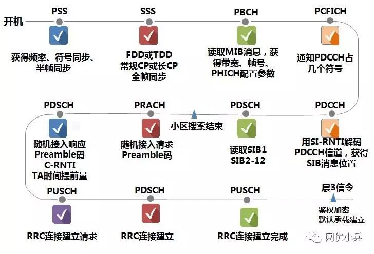
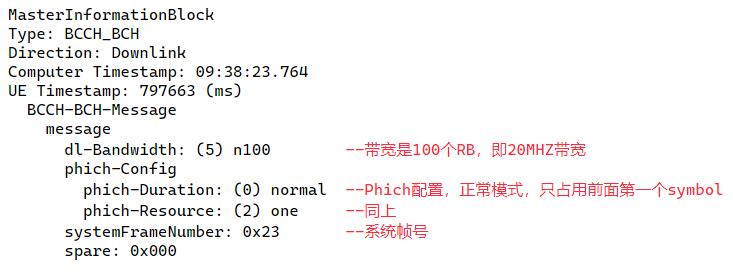
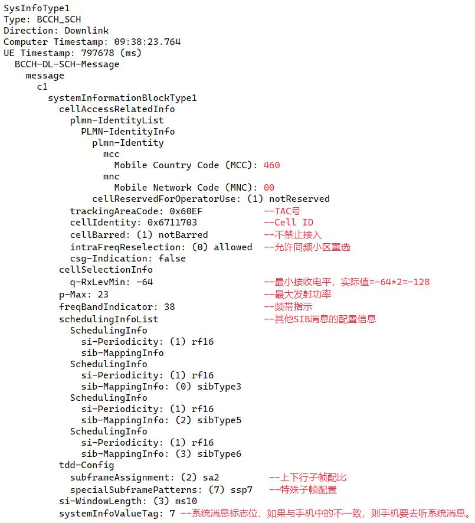

## LTE手机开机后所使用的信道

转自微信公众号：网优小兵

今天，让我们来看看，LTE手机开机后，所占用的信道：

### 第一步：解码PSS信号

PSS的全称是Primary Synchronization Signal，即主同步信号。

通过搜索PSS信号，手机获得：

1. LTE频点的中心频率。
2. 获得符号同步和半帧同步。之所以是半帧同步，是因为这个时候还没解码出SSS辅同步信号，因此，不知道是在无线子帧的前半帧还是在后半帧。
3. 确定当前这个小区的小区ID。我们知道PSS信号携带的是ZC序列，通过检测ZC序列，获得小区ID，即PCI模3的结果是0还是1，或者2。

### 第二步：解码SSS信号

SSS的全称是Secondary Synchronization Signal，辅同步信号。

通过搜索SSS信号，手机获得：

1. PCI的组ID，即168个组ID中，当前这个小区配置的是哪一个。解码出SSS信号后，组ID号加上PSS信号中的小区ID号，手机就获得了这个小区所用的PCI是多少。
2. 手机明白当前小区是TDD还是FDD。如果在PSS信号前一个符号位，检测出SSS信号，则说明是FDD小区。否则就是TDD，即在前3个符号位检测出SSS信号。
3. 正常CP还是扩展CP。CP就是循环前缀。通过SSS信号与PSS信号的时间距离，就可以判断出当前小区是正常CP还是扩展CP。
4. 帧同步。解码出SSS信号后，通过辅同步序列里的数据序列规律，就可以知道当前检测出SSS信号的帧，是前半帧还是后半帧。我们知道，SSS信号带的是M序列，前半帧的M序列由M0M1组成，后半帧由M1M0组成。

### 第三步：读取PBCH

通过读取物理广播信道的MIB消息，获得SFN系统帧编号、PHICH配置信息、载波带宽。有人会问，其他的SIB1、SIB2-SIB12消息呢，怎么不在PBCH里读取？

很不幸，这些SIB消息，都要去PDSCH信道去读取。

而每次要读取PDSCH的时候，都必须分**三步走**：

1. 先读取PCFICH。获得PDCCH是几个符号位。
2. 再读取PDCCH。获得PDSCH的调度信息，知道分配给我的PDSCH信道资源在哪个时间和频率位置上。
3. 读取PDSCH。

所以，在读取完PBCH里的MIB消息后，手机接续去读取SIB1消息时，就必须先去读PCFICH信道。

### 第四步：读取PCFICH信道

我们知道，PCFICH是在整个频域带宽上，均匀的4等分分布的。即一个LTE载波，有4个PCFICH的REG，均匀的分布在整个频率域上。

那手机怎么知道LTE小区的PCFICH具体是在哪4个REG上？

**PCFICH位置=PCI 取模（总的可用REG数）+i \* (总可用REG数/4)**，其中，i=0，1，2，3，分别代表4个不同的位置。

从上面这个公式可以看出，要获得PCFICH，需要什么条件？嗯，需要知道PCI，以及带宽（总可用REG数）。还好，在上面读取PSS和SSS的时候，就算出来PCI了，读取PBCH的时候，获取了带宽。

MIB消息实例：

### 第五步：读取PDCCH信道

通过读取PCFICH，手机知道了PDCCH信道占用了多少个Symbol符号位（1或2或3）。然后，手机就去PDCCH的公共搜索空间，去读取是否有系统消息SIB1的调度信息，怎么识别呢？通过SI-RNTI去盲检。现在全网所有小区的SI-RNTI都是默认的“FFFF”。当检测到SI-RNTI=FFFF的时候，就知道这里的PDCCH所携带的信息，是系统消息SIB1的调度信息，于是，手机就按照指示，去读PDSCH。

### 第六步：读取PDSCH信道

通过PDCCH信道，手机终于知道系统消息SIB1的调度信息在哪里。于是，它就去相应的位置读取PDSCH，获取SIB1消息。SIB1消息里有什么呢？

SIB1消息实例：

通过读取SIB1消息，手机获得了MCC、MNC、TAC号、小区CELL ID、是否barred、最小接收电平、最大发射功率、上下行子帧配比、特殊子帧配置。最重要的是，获得了其他SIB消息的配置信息，以及系统消息标志位，以通知手机当前系统消息是否发生改变。如果该系统消息标志位与手机中储存的值一致，则手机不用再继续去读取系统消息了。

### -

读取完PDSCH信道中的SIB1消息以及它所指示的SIB2-SIB12系统消息后，小区搜索结束，如果一直没有发起业务，则在TA Timer定时器超时之后，进入空闲态。

如果要发起业务，则手机在PRACH信道上，发起随机接入请求，并在PDSCH信道上接收随机接入响应，再在PUSCH信道上发起RRC连接建立请求，并在PDSCH和PUSCH上完成后续的建立完成消息、鉴权加密等，这就涉及到具体的信令流程了，在此不再赘述。