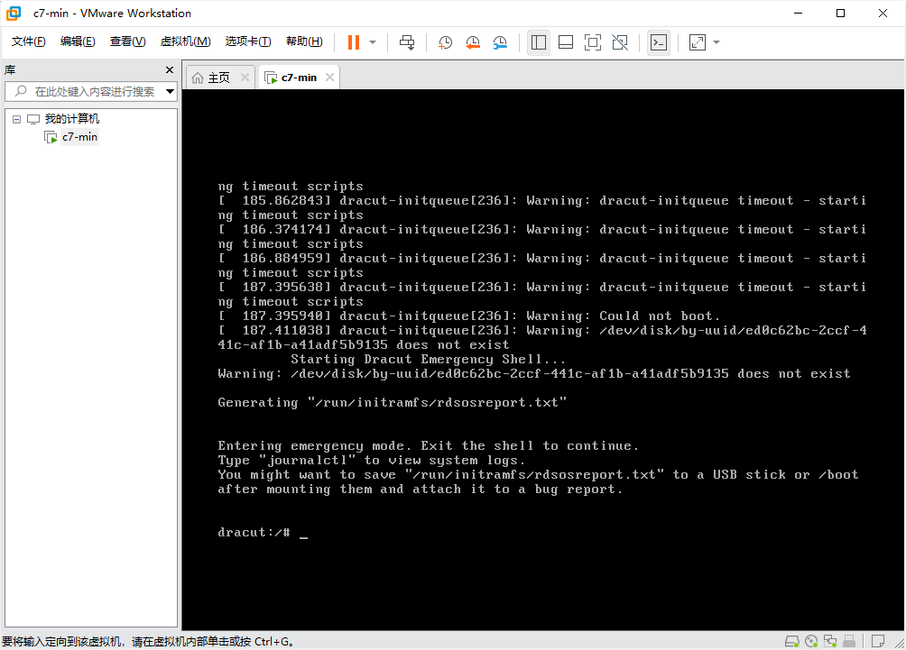
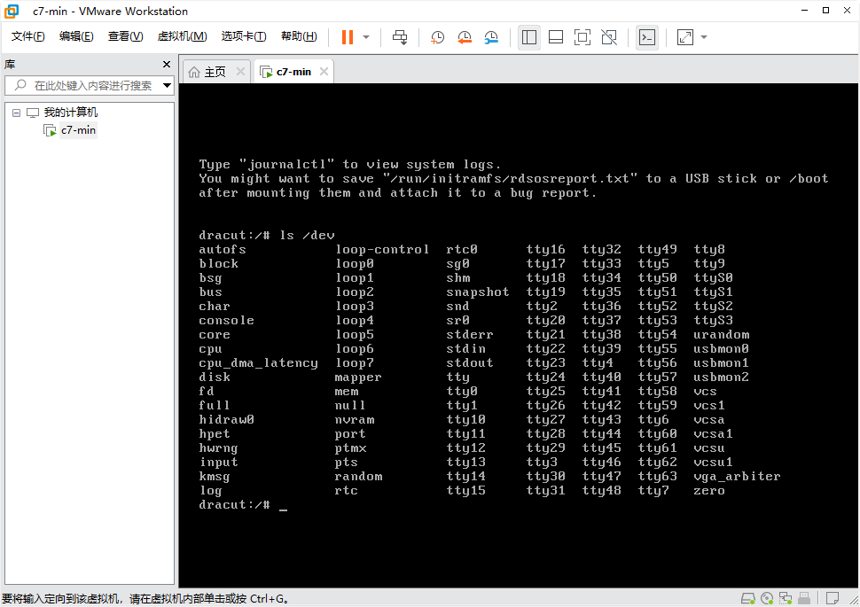
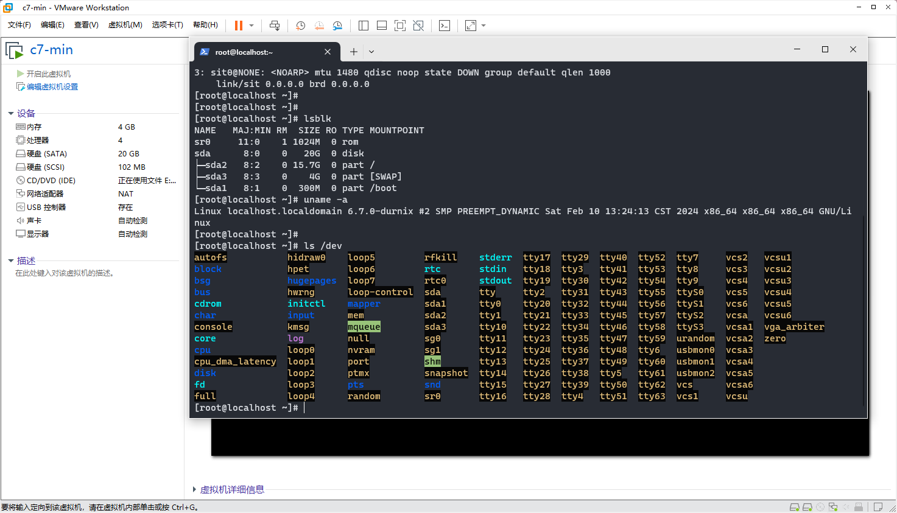

## 编译Linux 3.10.0版本 和 Linux 6.7.0版本

</br>

## 一、环境

1. CentOS7-2009最小化安装版本
2. 简单配置了一个国内yum源和安装了vim

## 二、准备工作

### 1. 内核版本下载

[`https://mirrors.edge.kernel.org/pub/linux/kernel/v3.x/linux-3.10.tar.xz`](https://mirrors.edge.kernel.org/pub/linux/kernel/v3.x/linux-3.10.tar.xz)

### 2. 可能需要安装的工具或依赖

`yum install gcc ncurses-devel perl`

## 三、过程

### 1. 源代码和内核功能配置

有多种对编译配置文件`.config`进行编辑的方式，久前有编译过，对于CentOS7最小化安装来说还是`make menuconfig`这种最友好, 这种需要安装ncurse-devel这个依赖

```shell
tar -Jxf linux-3.10.tar.xz
ln -s linux-3.10 /usr/src/linux
cd /usr/src/linux

# 手动定制内核需要哪些功能（网络、设备驱动、文件系统等的支持）
make menuconfig
```

功能选择界面


### 2. 打开SCTP DEBUG(支线任务)

`Networking support`  ---> `Networking options`  ---> `The SCTP Protocol`  ---> `SCTP: Debug messages`

### 3. 继续编译

在`/usr/src/linux`下

在`make menuconfig`过程中因为改了输出文件`.config`默认的名称，`make`编译的时候会出错，查看`make help`好像没看到指定配置文件名的操作，所以需要将自己命名的配置文件复制命名为`.config`，然后编译(最好不改因为容易忘记写到`.config`中)

```shell
#使用4个线程编译(本机只有4个)，或使用make -j`nproc`
# 编译一般没有问题，内核对其它项目库依赖几乎没有
make -j4
```

编译过程


### 4. 安装

```shell
# 生成的文件，
ls -lh arch/x86/boot/bzImage

# 有一些模块并未直接编译进内核中，而是以独立的内核模块的方式进行编译
# 不安装内核模块可能导致一些功能不正常
make modules_install
# 直接安装到当前操作系统下
make install

```

### 5. 重新生成引导文件(CentOS7)，然后重启选择内核
```shell
dracut -f	#可选

grub2-mkconfig -o /boot/grub2/grub.cfg
```

## 四、结论

在VMware虚拟机下无法成功运行，尝试了很多方式不行，都报错"客户机操作系统已禁用CPU，请关闭或重置虚拟机"(**之后换了KVM尝试，也是无法运行**)

考虑，久前曾编译过5.12版本能够成功运行，所以想可能换个内核版本可能更容易些。遂准备尝试编译最新版本。

## 五、编译Linux6.7.0版本

### 1. 内核版本下载(Linux内核版本6.7.0(2024年2月9日)

[`https://mirrors.edge.kernel.org/pub/linux/kernel/v6.x/linux-6.7.tar.xz`](https://mirrors.edge.kernel.org/pub/linux/kernel/v6.x/linux-6.7.tar.xz)
### 2. 依赖和环境

```shell
# 简化版，三行并作一句
yum install -y ncurses-devel flex bison perl elfutils-libelf-devel openssl-devel centos-release-scl \
    && yum makecache fast \
	&& yum install -y devtoolset-11-gcc devtoolset-11-gcc-c++ devtoolset-11-binutils \
	&& scl enable devtoolset-11 bash
```

```shell
# 详细描述版

# AI解释：在Linux中安装flex和bison通常是为了编译和开发需要
# 词法分析器(Lexer)和语法分析器(Parser)的软件项目。这两个工具是构建复杂
# 语言处理程序的重要组成部分，尤其是在创建或修改解释型语言、脚本语言、
# 编译器、解析自定义配置文件格式等场景下非常有用。
yum install flex bison

# 如果安装过vim会自动安装perl，否则要安装
yum install perl

# 编译此版本的内核需要更高版本的gcc, 提示是Minimal GCC Version: 5.1.0
# 这里安装能支持的最新版本v11
yum install centos-release-scl
yum install devtoolset-11-gcc devtoolset-11-gcc-c++ devtoolset-11-binutils
# 每次重新登录要运行下面命令，启用gcc11，否则还是系统默认的gcc版本
scl enable devtoolset-11 bash

# 解决编译中出现gelf.h缺失的问题: fatal error: gelf.h: No such file or directory
yum install elfutils-libelf-devel

#解决编译中出现openssl/bio.h缺失的问题: fatal error: openssl/bio.h: No such file or directory
yum install openssl-devel
```

### 3. 配置和编译

预配置：`make x86_64_defconfig`可以用来生成一个默认的配置文件，可选

配置：`make menuconfig`

编译：`` make -j`nproc` ``问题不大

## 六、运行与问题解决

换6.7版本内核虽然还是不能一次跑成功，但至少日志变了，能看到更多日志

重要的提示为：**Warning：/dev/disk/by-uuid/xxxxx does not exist**

### 1. 问题：硬盘不存在

1.1 网上尝试一个解决方式：在`/etc/default/grub`文件中添加`GRUB_DISABLE_LINUX_UUID=true`语句，无用

1.2 查资料发觉dracut模式下可以使用ls命令
	
在dracut模式下`ls /dev`查看是否有sda等设备，没有(~~sda~~)


进行试验：VMware下给该虚拟机增加两个硬盘，接口分别选择IDE和SATA然后再看：果然，识别到两个(sda、sdb)

	
久前编译过5.12版本，记得当时也是特别选过一些驱动

最终推断是VMware使用的硬盘接口为scsi的原因，需要选上相关的驱动

进行尝试选择上scsi相关的功能支持后还是未能启动成功，遂将此虚拟机删除再重建一个新的并将硬盘接口设置为SATA类型，重新进行上面的编译安装过程

开机，成功运行


### 2. 进一步实验

在上述成功运行的6.7版本内核基础上，虚拟机增加一块scsi接口的硬盘，查看是否识别：未识别，说明确实就是硬盘驱动的问题，但之前选了scsi玄关的驱动却仍然无法识别？


后来在翻内核选项时看到了一组特别的选项，回忆应该是选中这里才是真正能够支持scsi而不是之前设置的地方

- **错误的配置incorrect**(×)：`Device Drivers`   ---> `SCSI device support`  ---> `Asynchronous SCSI scanning` + `SCSI low-level drivers`( ---> `LSI xxx` + `Wmware PVSCSI driver support`) (ps.经过实验至少默认选中的`SCSI disk support`得保留,不选的话一样不行)

- **正确的配置correct**(√)：`Device Drivers`   ---> `Fusion MPT device support`   ---> `Fusion MPT ScsiHost drivers for xxx`


关键词：`Linux kernel compile`, `Warning：/dev/disk/by-uuid/xxxxx does not exist`, `Vmware`

按照上述配置之后使用VMware scsi接口类型硬盘的内核能够识别(后来重新安装系统并把主`root fs`硬盘接口类型设置为scsi验证通过)


