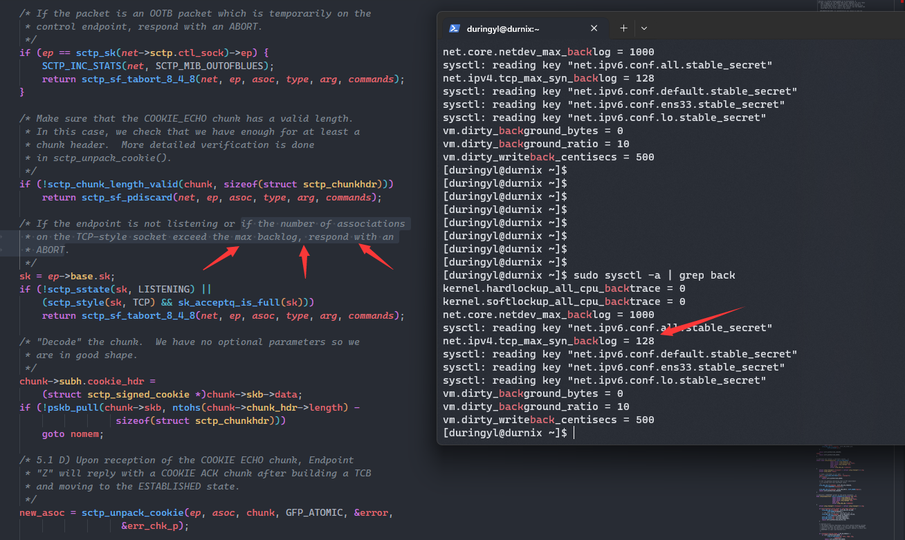
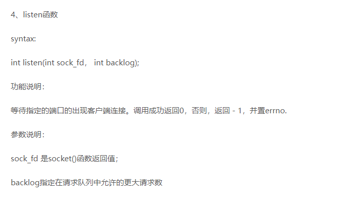

## TCP/SCTP协议在Linux系统下的syn backlog机制

### 起因

某次在一个环境中部署公司开发的软件系统, 与常用测试环境不同的是虚拟机使用VMware, CPU是AMD

软件系统会使用到的协议是SCTP, 会短时间内模拟大量SCTP客户端发起连接SCTP服务端。

抓包现象是模拟客户端发送了大量Init,且收到了服务端的Init ACK, 但在客户端发送COOKIE ECHO之后收到了服务端的Abort

### 分析与猜想

查找SCTP源码在接收COOKIE ECHO时的处理, 有一个主要Abort分支被注意到:

即会像TCP一样正在等待完成握手的连接的并发数量是有一定限制的, 积压数量超过限定数量后的新连接将被拒绝

查询sysctl可知可设置一个内核参数来增加等待完成握手的连接的并发数量(系统默认是128)

另外系统的listen函数在使用时也可传一个backlog参数, 来限制短时间内大量并发的情况(被告知SCTP服务端限制了最大数量是5个)

### 解决

限制模拟客户端的并发速度, 使服务端能顺利完成所有的握手连接, 再进行后续的业务传输。
