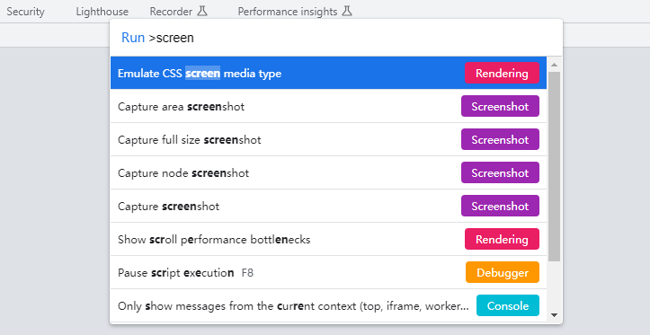
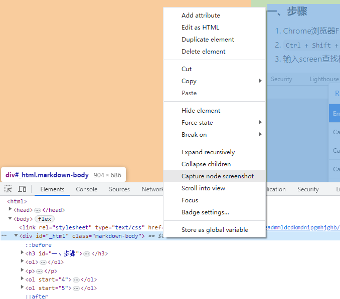

### 浏览器原生截图功能 - 步骤

1. Chrome浏览器F12打开开发者模式
2. `Ctrl + Shift + P`可打开命令输入界面, *vscode、Windows Terminal有差不多操作*
3. 输入screen查找相关命令, 看到如下内容

    

4. 选择`Capture node screenshot`, *试过其中的Capture full size screenshot, 会直接生成截图, 但体验极差不推荐*
5. 选择后貌似什么也没有发生, 但其实已经生效了, 关闭F12等-> 打开网页-> 右键-> 检查-> 选中想要打印的元素-> 右键-> (出现)Capture node screenshot

    

6. 生成的图片保存在浏览器的下载路径中

