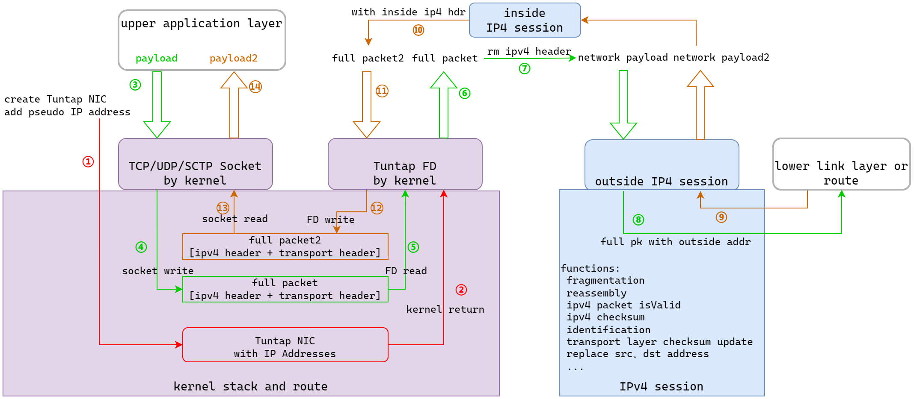

### 一、目的/作用: APP与外部服务器正常使用ip、tcp、udp、sctp协议，并且将这些数据路由到任何自己想要的地方，比如路由到天上。走操作系统的路由的话无法控制把消息发上天，两种方案:

1. 自己实现上述所有协议栈
2. 想办法调用操作系统(内核)的协议栈

### 二、Linux tuntap虚拟网卡特性: 如果数据包经过这个虚拟网卡，其FD(socket)能够抓取到这些数据包，这些数据需要手动处理路由(内核路由不再处理, 但你可以让这些数据再次进入内核路由)

1. tap模式: 收上来的包包含链路层
2. tun模式: 收上来的包不包含链路层
3. 高级路由：Linux设置高级(源地址)路由，数据才一定会经过tuntap虚拟网卡，否则数据走物理网卡不走tuntap虚拟网卡, FD抓不到数据

### 三、数据包被操作系统截胡: 因为我们使用了本机的IP和raw socket

1. raw socket: 内核除了将数据分发给对应的raw socket, 其它符合的socket也能收到数据(复制), 也就是内核会同步处理这些数据包。
2. 内核对目的地址是本机的IP包处理: 如果本机没有APP创建了**对应**传输层socket, 对于tcp内核回复tcp rst包, 对于udp内核通过icmp回复port unreachable, 对端收到这些包后认为连接失败。
3. 对方认为连接失败了, 你的raw socket再发什么都没用了。

### 四、手动管理网卡和实现ipv4协议栈

1. 网卡从链路层raw socket收包, 并且网卡不下挂IP地址, 这样就不怕被内核'截胡'。
2. 网卡操作：为了没有干扰包(别的主机不主动发消息给我们，操作系统也不从这个网卡发消息)，网卡下不加任何IP。手动处理ARP协议，并接收ipv4的消息
3. 手动管理IP: 发送和回复ARP请求 = 在网络内公布 [ip xxx] is at [link addr xxx(网卡地址)]
4. ipv4分片组包地址替换等操作: 无法用操作系统的ip协议了

### 五、图示

