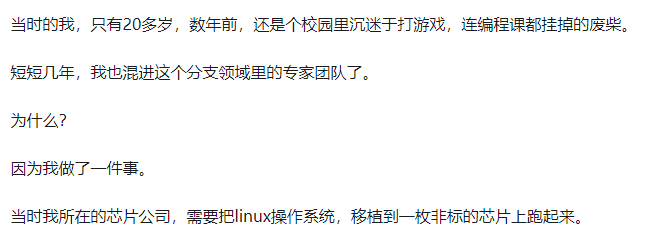

## -

读完了七颗龙珠的文章，对于高认知这些或许老祝也可以唠唠。纯“学术交流”。

貌似讲了很多，貌似讲了人生的通途，什么都讲了，认知很强。但有没有一种怪怪的感觉，那就是没有讲方法论，有点太脱离，没有讲我们是否都要努力去拥有那些龙珠，没有讲同时拿起那些龙珠会不会出问题。

文章没有回归现实，可能就算看了，对生活的影响实际不大。

不如看看老祝的方法论——**契机论**：
	
> 有话说人到什么年纪就做什么样的事，老祝觉得不那么准确，应该改为：人遇到了什么样的契机就做什么样的事。 

> 契机是能让人进入状态的时间点和事，遇到契机的时候顺着走才会有事半功倍的效果，这种效果能让一个人真正得到改变。 

> 单只看一篇文章、一个励志视频，难以让人改变，这是我们经常遇到的事。因为现实没有变化，现实没有朝着人意志的方向流动，如此可能需要更多的努力才有收获，但很多时候个人意志先被现实淹没了。 

看看文章的作者，说“20多岁当时是连编程课都挂掉的废柴，但短短几年成为了领域的专家，因为干了一件事”：

  

一个人不是一开始就牛逼，甚至最初只是"废柴"一样的人物，但这个时间点上，让他做这件事，这就是他的**契机**，他同时在这个方向上付出足够的努力，得到了效果。要是没有这个契机，是否多少会对他的人生格局有一些影响？

  （ps. 说个题外话一个编程课都挂的人，他真的拥有第三颗龙珠——**喜欢**这个领域吗？）

如果意识到遇到了某个契机，不妨先不顾虑最终什么结果，只管往前。

## -

另外一个联想到的观点是：有没有可能自己已经是很牛的人了。

前段时间老祝在香雪那边看到一栋很高的清华xx研究院的大楼，感觉并不出名，当时就和同学说，这个世界大部分都是由草台班子构成的。

卓越的人不多见，每一次卓越的人出现会把领域向前推进一大步，然后就是沉寂期，很多人可能起点高，拥有前两颗龙珠，他能进清华研究院，但卓越的人不多见，沉寂期的人组成草台班子。不是咱不能，凭借咱的智商，可能给一个契机，咱也能进入状态，做出的成绩不一定就比他们差。同学表示没毛病。

从草台班子这个角度出发，提出一种思考，没有可能自己已经是很牛的人了，很多事情都能做，但事情太多了，不是每一件都要去做，只是在做契合契机的那件事。

这又让老祝想到了一次和朋友吃饭的过程，旁边一桌的人在聊经济局势，期间朋友说“在听旁边那桌人在聊经济”，当时和朋友也算在经济和股市里混挺久了，混市场像悟道也需要悟性，老祝和朋友说：有没有可能我们的对经济和市场的见解比他们深刻和准确。朋友表示赞同，虽然对方看起来像牛逼商业人士，但凭咱的智商和阅历完全有可能见解比他们好。

## -

再说回投资

这个作者说自己在市场里赚了，牛逼，说自己对人性的理解比"广大读者"要好。但实际上有没有可能这只是他目前意气风发能说出的东西。
（ps. 题外话作者如果很牛逼很成功，那么他更新那么多文章的动机是什么，是达则兼济天下去普渡读者吗，真正到那种境界只会以这种方式去兼济天下吗）

在实际的市场里，就算广大管理几十几百亿的专业基金经理没有谁说自己是稳赚的，年化收益接近10%已经是很不错了更别提有的年度会亏损。即使《股票大作手回忆录》中的传奇利弗莫尔，在市场混了几十年，一个很专业的人，有过最高光的时刻，但最后也会亏光所有资产然后自杀，就连这样的人，也不能说自己百分百就是赚的。只是，现在是赚的，现在是意气风发的时候。

市场里一句很经典的话：凭运气赚来的钱，会凭实力亏光。作者说自己是做高频量化交易的，实际上也是一种投机，有没有可能一天他也会亏光，那么他还会出来说自己多么懂人性多么懂投资吗？

为什么，因为在市场里，只要是赚的，人很难收手，人只有受到了伤害才会收手，否则赚来的钱再投进去，越玩越大，盈亏也越来越大。

## -

雅俗共赏

现实就是有很多琐碎，我们可以懂得很多道理，可以思考到甚至进入哲学范畴，非常高深理性的认知。

但终归要回归现实，在现实中雅俗共赏，允许一切发生，允许有些东西他就是存在，无论是自己喜欢的，还是不齿的。
