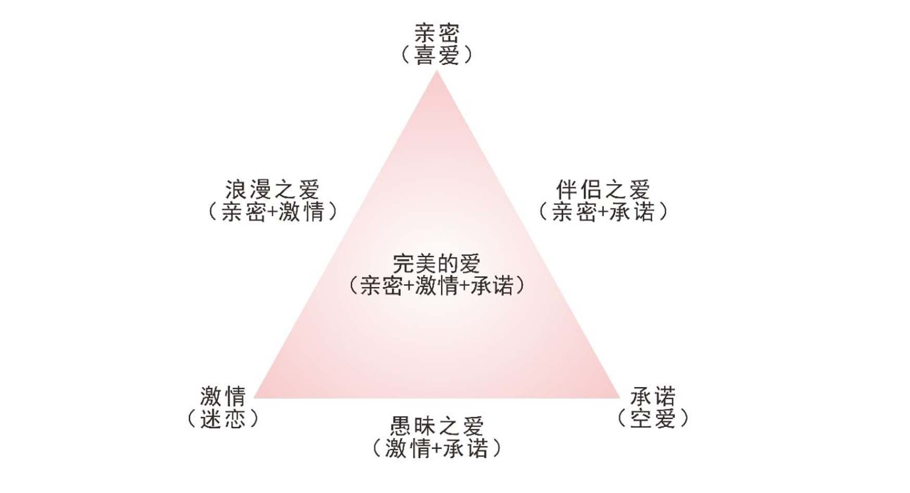
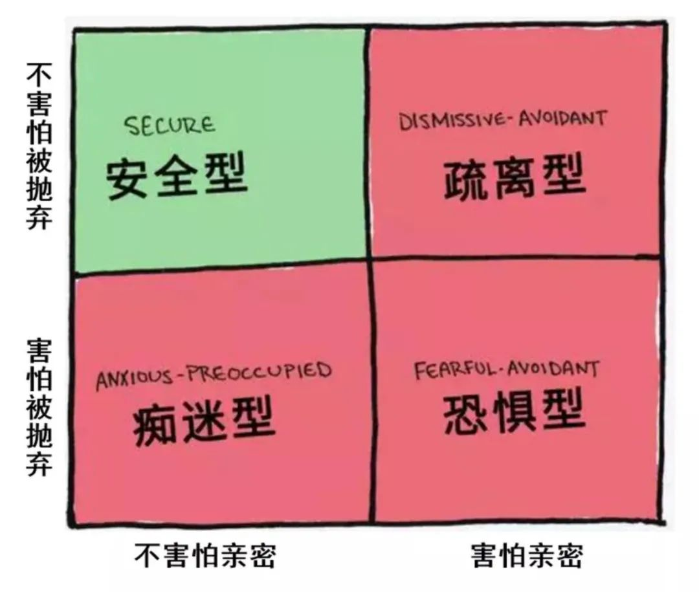

## 爱情三元论：什么才是完美的爱情

霸总甜宠，欢喜冤家，青梅足马，相爱相杀…

在无数有关爱情题材的影视作品里总是会描绘出各类不同形态的“爱情”。

有些看上去非常套路且烂俗，而有些则充满了罗曼蒂克与甜蜜，还有一些看似琐碎朴实不起眼，但每每不经意间回忆起却意外地接地气且动人。

那么，爱情的种类又这么多，**但爱情的起因是什么？真正的爱情又该如何定义？怎样能让爱情维系长久？**

### 一、定义

爱情三元论：又名“爱情三因论”、“爱情三角理论”。认为爱情由激情(Passion)、亲密(intimacy)和承诺(commitment)三个核心部分组成。

激情是指对于身体的欲望、性的欲望，情绪上令人着迷的部分；亲密是指爱情中的陪伴引起的温暖体验；承诺是指理性思维对于关系给予的认知和期许。

### 二、效应来源

爱情三元理论是由美国耶鲁大写心理学、社会学教授罗伯特·J·斯多伯格于1986年提出并发表的。

是斯多伯格在激情型爱情和友伴型爱情得到心理学业内的普遍认同的基础上，有收到了奇克·鲁宾的"喜欢对爱的理论"和约翰·李的"爱情色轮模型"的影响，于是建立了这样一个三角模型，并对爱情所产生的各种形式也进行了更精确的细化与区分。

斯多伯格认为爱情关系之中由亲密、激情和承诺三因素组成，而三个部分强弱不同的时候，这个三角模型就会随之发生改变，形成各种一下七种不同类型的爱情：

1. 喜欢式爱情(Liking): 主要以亲密感为主，有很高的感情舒适度。和友情、相熟的人之间产生的感情关系非常相似。
2. 迷恋式爱情(Infatuated love): 主要以激情为主，会认为和对方之间有很强的吸引力，完全凭自己的感觉和本能来引导，类似于"初恋"、"青春期恋爱"等这种充满了冲动但没有亲密、和承诺之间发展的感情。
3. 空洞式爱情(Empty love): 主要以承诺为主，例如"包办式婚姻"这种纯粹为了进入婚姻保妥单身模式进入拥有配偶模式的感情关系，缺乏感情联系与亲密感的"内核"。
4. 浪漫式爱情(Romantic love): 拥有亲密关系以及激情体验，但是不包括对于未来的长久规划。例如"一夜情"这类关系模式，属于浪漫式爱情的一种。
5. 伴侣式爱情(Companionate love): 拥有亲密关系和承诺，但是没有激情体验。比友情关系要强烈一些，但缺乏激情，式比较四平八稳但是能够长期且稳固发展的一种关系模式。
6. 愚蠢式爱情(Fatuous love): 拥有激情体验与承诺，但是缺乏亲密关系。例如"闪婚""闪离"这一类因生理上的冲动支配直接进入婚姻的关系模式。
7. 完美爱情(Consummate love): 同时具备以上三种因素，代表着人们所向往的"理想爱情"关系。

除却以上几种之外，还有一种式非爱慕关系(Non love): 缺乏以上三个因素，对待感情持冷漠态度。

爱情三元理论主要用于向人们说明：爱是由多种感觉的混合而产生的一种复杂的存在，并且是一种"动态"的、能够通过认为努力去调整的一种结构形态。

### 三、相关科普

美国心理学家伯纳德·默斯坦在1970年发表的一篇论文里提出了著名的爱情阶段理论，认为爱情的发展可以分为三个阶段: 刺激阶段(Stimulus)、价值阶段(Value)、角色阶段(Role)。

**刺激阶段**: 在两个人初次接触是，我们倍对方的外貌、身材、性格、谈吐等条件吸引，并由此对他产生好感，被内心极大的好奇心驱动想要更多的探索、了解对方。如果双方都有同样的感觉，那么这种迷恋、激情，会促使我们进入到关系的下一阶段中。

**价值阶段**: 在双方开始逐渐了解彼此并付出时间来培养感情的阶段，我们会确认彼此的三观与兴趣爱好、生活节奏等方面是否相似，对于有冲突的部分能不能够调和与解决，并在此过程中培养出了默契与亲密感。如果该阶段发展顺利，就会进入下一阶段，若是不顺利，这段关系便可能直接中止。

**角色阶段**: 这个阶段中，双方的感情逐渐趋向稳定，我们会给予对方承诺并向对方提出要求，看看能否扮演好满足我们一部分需要的"角色"。通常在这个阶段，也是关系进入了适合步入婚姻的发展阶段。

因此我们可以知道，在爱情关系发展的不同阶段，我们都能够有机会去培养出"完美爱情"中缺失的部分，并且根据关系的逐步深入，增强缺失部分的比重，让我们建立起更为稳固、健康的一段情感关系。

**在生物学中如何看待爱情？**

斯多伯格从情感的角度向我们呈现了爱情的构成，而美国生物人类学家海伦·费舍尔则从人类的生理角度上提出：**爱情是由我们身上三种既相互联系又截然不同的生物系统：性欲(sexual desire)、吸引力(attraction)、依恋(attachment)来控制我们分泌出的物质成分组成的。**

**性欲**: 由内分泌细胞分泌出的性荷尔蒙进行调控，使人们产生交媾、生殖的冲动，这种生物信号会促使我们去寻找配偶，进行生育繁衍。

**吸引力**: 由大脑内分泌出的多巴胺和5-羟色胺调控，多巴胺能让我们在爱情中获取到更多快乐、兴奋情绪的感受，而羟色胺则会让我们保持冲动去不知疲惫的进行对快乐的追逐与索求，让我们拥有一直将情感关系继续维系下去的动力。

**依恋**: 由人体大脑下视丘与神经元分泌的神经肽催产素来提供和启动我们依恋他人的愿望，沉醉于与伴侣在一起时感受到的温馨、舒适的情感感受。

所以在我们人类的生物本能中就拥有这繁衍的本能驱使而去追寻爱情关系的部分，只是虽然拥有去追求的本能，但关系的维系与经营依然需要我们付出时间、耐心、精力去培养。

### 四、案例分享

    “英台不是女儿身，因何耳上有环痕？”
    “耳环痕有原因，梁兄何必起疑云，村里酬神多庙会，年年由我扮观音，梁兄做文章要专心，你前程不想想钗裙。”
    “我从此不敢看观音。”
            ——《梁山伯与祝英台》

梁祝是我国古代民间家喻户晓的一段爱情故事。

祝英台女扮男装前往书院求学，途中偶遇同样前往书院的梁山伯，并与其一见如故，结伴通往。

在而后的三年里，两人身为同窗结下了十分亲密的情谊，祝英台内心对梁山伯产生了爱慕之情，而梁山伯此时也感受到了来自祝英台的吸引，只是碍于性别不敢僭越。

直到祝英台向他袒露了自己的真是性别，两人互诉衷情，梁山伯才恍然大悟并承诺上门提亲两人相守一生。

然而因为提亲过程拖延太久被另一名同窗马文才抢先下聘定下亲事，梁山伯得知之后心碎不已，病重离世。祝英台便在迎亲途中前往墓前祭拜，没想到坟墓竟然因她的到来而裂开，于是她奋不顾身一跃而下，两人一共化为一双蝴蝶从墓中翩翩飞舞而出。

在这段故事里，我们便能发现两人一起经历了三年同窗这个培养亲密的部分；梁山伯询问祝英台耳朵痕迹暗暗吐露心声的激情、迷恋部分；承诺长相厮守被人破坏后超越生死前往赴约的激情、实践承诺的部分。由此可见这段激起了亲密、激情和承诺三因素的爱情，十分符合人们对于完美爱情的憧憬与想象。

再加上"化蝶"这一悲剧有浪漫结尾的升华，正是能让这段股市从汉晋时期一直流传至今经久不衰的重要原因。

### 五、个人见解

**爱情究竟是什么?**

这是一个古往今来被无数人们乐此不疲津津乐道的一个话题，而不同的人心中对此也都拥有不同的答案。

我们在上文中提到了很多爱情模型，但是在实际生活里的爱情会呈现出远远比这些要更多更复杂的形态。

因为这个世界上并不存在两个相同的个体，所以我们和每一个人之间产生的关系都是独一无二的。

并且，这个世界上也并不存在一个通用形态的"爱情"定义，关于爱情的定义权永远握在我们每个人自己的手里。

好的感情从最初的吸引到最后的携手而终之间存在了太多太多的困难与变数，所以才会有俗语告诉我们"相爱容易相守难"。

爱情观念可以拥有千万种，**我们可以不去追求一段稳定且长久的感情，但是经营爱情的能力却是需要我们好好学习并且持续付出努力的过程。**

心理学家们会运用各种心理学知识来帮助我们了解爱情的组成，给予我们更多不同的视角和角度去理解爱情的呈现方式，告诉我们一段好的感情关系应该用什么方式去建构。

在这个过程中，我们可以更加了解对方也了解自己，更加明确自己对于感情的需求究竟在哪一个部分占比更多，更加能够学会去经营一段长久的感情关系。

被世人所承认的"完美爱情"，可能并不一定会是你想要的。

而能让你感到最适合你自己的那份感情，其实就是这世上最完美的爱情模样。

      

## 依恋类型理论

心理学认为，一个人具备的“依恋模式”通常是建立和维持一段关系的核心。依恋模式是在同年早期就已形成，但会在我们的亲密关系中表现出来。

比如，如果一个人的父母经常表现得分离或拒绝，就可能让孩子形成一种“回避型”得依恋风格，会认为“我不需要任何人，我是独立的”。在亲密关系中得ta可能会把伴侣推开，在争吵中退缩，不愿分享自己的感受，在亲密了一段时间后突然停止发消息，不愿对关系做出承诺。

虽然我们不能从一小部分人得约会行为样本中确定一个人得依恋类型，毕竟这是非常复杂得领域需要适当得临床评估。但我们仍然可以据此看出一个人所表现出来得安全、焦虑或回避得依恋倾向。

### 一、四种依恋类型在恋爱时得表现

**安全型——我很好，你也不错和**: 安全型依恋风格的人通常由这样的照顾者抚养长大：养育着通常是可靠的，能够做到抚慰和滋养，不会过度惩罚孩子。安全型依恋的人会对亲密感到舒适，能够做到自主，对关系做出承诺，能够调整在恋爱中保持联系和自我披露的节奏，不会过于敏感地捕捉到拒绝，能够安慰自己和他人。

安全型的人会评估自己的另一半，确定这段关系是否感觉是“对的”，两人是否合适。ta们可以接受单身，也会在关系和时机恰当的时候选择成为伴侣。ta们能管理自己的情绪，在亲密关系和友情中保持开放和分享。ta们能很快作出回应，会保持沟通交流的一致性，不会试图过快地建立一段关系，也不会过度地表现出嫉妒或苛求。

**回避型——我不需要你**: 回避型风格的人往往苦恼于“依赖”，可能会表现出极度独立，害怕和人亲近，在痛苦时选择退缩或拒绝对方。伴侣可能会觉得不被倾听或者不被关注，觉得自己可有可无，随时会被抛弃。回避型的人可能更喜欢自由和独立的感觉，因此很难对一个人做出承诺。和回避型交往的另一方可能会在这个过程中感到很困惑。

回避型的人可能会在一段时间的亲密后开始退缩，把自己缩回去，不能或不愿意让一段关系继续深入，对关系的处理变得冷淡或随意，可能永远不会建立真正亲密的关系，会把自己描述为是“孤独的”，在一段关系正要变得紧密时选择抽离，不想谈论生活中一些关键的领域。

**焦虑型——我真的真的很需要你，别离开我**: 焦虑的人通常会很快产生强烈的感情，很难做到独立，可能会表现出强烈的依恋倾向(比如需要频繁的联系)。ta们可能永远不会觉得自己得到了足够的亲密，会打破边界，经常因为渴望得到支持和安慰而吓跑别人。ta们可能总是感觉到被拒绝，需要很多很多的亲密。

那些有焦虑依恋风格的人可能会发生一段强烈却草率的感情，比如觉得自己在一次约会之后就遇到了生命中的真爱，渴望和对方经常保持联系，在不联系时会变得焦躁不安或刻薄，比如对另一方说：你是对我不满意吗，为什么不回我？

ta们可能过快、过多地表露自己，会表现出嫉妒，或通过各种方式让一段关系的发展速度快于实际理想的情况，比如要求一个星期的每天晚上都和人见面。

**焦虑-回避混合型——我不需要你，走开。别啊。回来！**: 经典的“推拉”模式。这通常发生在某人对亲密感到不舒服，所以推出或拒绝伴侣，但也担心因此失去伴侣的承诺或亲密，然后试图寻求联系。

这种状态对另一半来说尤其令人困惑，除非ta们能够看到这种拉锯状态背后的依恋模式。这种模式表现出来的一些行为可能包括：试图靠近对方，然后又离开；幻想着结婚，但随后又不再喜欢对方；连续三天见一个人，然后三周都不见面。

ta们对亲密感到窒息，于是不给对方发消息。但等ta们注意到另一方也不再给自己发消息时又很恐慌，把对方再拉回来。这些感觉似乎无处不在，而且不一定是那些依恋有困难的人能够有意识控制的。

**在**我看来，人们所谈论的大部分糟糕或棘手的恋爱行为——“玩失踪”“养鱼”“吊着对方”“吃回头草”都可以通过观察一个人的“依恋模式”来解释。

### 二、如何打破“不健康依恋”

“依恋模式”可以随着时间和一段稳定的关系发生改变，但仍需要我们做出一些努力：

    觉察自己的依恋模式，看看它是如何再约会中发挥作用的
    有想要改变这种情况的愿望(即需要你自己想改变自身的模式，没有人能帮你做到这一点)
    愿意反抗你的“依恋模式”所带来的惯性冲动
    拥有一些稳定的关系支持(朋友、恋人、家人)

任何关系，无论是柏拉图式的精神恋爱还是一段亲密关系，都需要时间来建立。我们需要慢慢了解另一个人，在不同的环境中观察对方，让对方和我们在一起时感到安全，我们和对方在一起时也感到安全，这个过程可能需要几年，而不是通过几天或几周就能决定。

处理这些困难的关键是仔细观察你自己在所有关系中的行为，确定你是否有焦虑型、回避型、或混乱型的特质，并了解它们在不同情况下是如何发挥作用的：

    你昨天有没有给某人发了40条消息，而你们其实才进行了一次约会？
    你是否经常嫉妒伴侣新认识的朋友？你对朋友是否有很强的占有欲？
    你是不是从不与伴侣分享自己的困难？
    你是否注意到对上周还很亲近的人，突然感到疏远了？

停下，观察，思考。尝试采取和旧有依恋模式冲动相反的方式。

对于焦虑型依恋的人来说，着意味着要放慢速度，关注生活的其它方面，比如你的爱好和朋友，尽量减少幻想。提醒自己，你真的还不了解你的约会对象，人们都有自己的生活，因此永远不可能提供持续的联系。这也意味着管理你和对方的联系频率，即便是对方先联系你，你也可以使用每发一条只回一条消息的规则来约束自己。记住着如果是真爱，它不会跑走。

对于回避型依恋的人来说，着可能意味着给你看到的人会消息，而不是消失不见，注意到这种想要保持距离的冲动可能是依恋模式的一部分，然后等待这种感觉过去。有时，与约会对象或朋友联系有助于打破有依恋模式。你可以计划一次约会，告诉对方你有些矜持，但想试着克服它。与亲密的朋友、家人或咨询师分享你的一些事情，这些关系有助于改善你的依恋模式。

对于焦虑-回避混合模式的人来说，关键是为自己设定前后一致的行为规则并坚持下去(例如，一旦我决定不再给某人发消息，因为我们的关系不会有任何进展，我就不会试图重新开始这段关系)。同样重要的是，要抵制焦虑和过度亲近的冲动，然后拒绝。保持平稳、缓慢的节奏是关键：例如，一周一到两次约会，一天只发几条信息，可以帮助依恋焦虑的部分有所下降。

随着时间的推移，当我们深入了解自己的行为模式，为自己制定一些现实的指导方针，突破依恋风格的限制，找到更大的稳定性和一致性时，我们可能会发现恋爱感觉更容易，更愉快，更受尊重，更少感到混乱。

### 三、理论

1950年英国发展心理学家John Bowlby提出了依恋理论，研究个体与重要的人之间的亲密和距离间的最佳平衡的感知。依恋人格主要分为四种：

**安全型依恋人格: 我知道ta会在我需要ta的时候出现**

这一人群乐于独处、对于自己与他人的社交有着一定的自信，可以建立良好的朋友关系与亲密关系。安全型依恋人格也可以稳定的为伴侣提供安全感。他们愿意与亲密的人进行深层次交流，不会担心对方是否会离开或抛弃自己。

原生家庭：童年时期，父母会在孩子需要他们的时候及时给予帮助和回应。因此，这一群人对于日常生活和事情都可以抱有积极的态度。在他们的思维中，可以大胆地去爱自己喜欢的人，并且觉得当自己需要帮助时，爱他们的人可以为他们提供帮助和支持。

**焦虑型(痴迷型)依恋人格：害怕ta不会像我爱ta一样**

这一人格害怕独处或保持单身，也是被认为最容易被pua的，因为安全感对于他们来说是最重要的。当他们处于一段亲密关系中，容易有强烈的被伴侣抛弃的恐惧感，从而更多依赖对方。

原生家庭：童年时期，父母的情绪波动大、阴晴不定、非连续性地给孩子关怀。有时表现出非常的关爱，有时则不闻不问。所以到了成人阶段，他们迫切希望得到一段稳定关系，且对方需要让他们感受到明显的爱。

**回避型(疏离型)依恋人格：没问题，没有ta我也能很好**

回避型人格非常独立、原则感强，人际交往会让他们感到窒息。让门容易想跟伴侣保持一定的距离，或者不付出感情，更喜欢依靠自己。

原生家庭：父母对于孩子的控制欲强，喜欢替孩子决定或者不听取孩子的想法与需求，不会对孩子表现出父母的关爱（更像老师与学生的关系）。所以到了成人阶段，孩子更想要独立生活，不受他人干扰。在他们的思维里防止他人伤害自己，他们会选择独立。

**恐惧型依恋人格：我真的喜欢ta，但ta说我让人产生一种距离感**

这种人格其实是焦虑型和回避型人格的组合。他们不仅害怕亲密关系和承诺，而且他们不信任任何试图接近他们的人，甚至会对他们发脾气。这一人群既极度渴望爱，又想不惜一切代价逃避爱。

原生家庭：对于恐惧型依恋人格来说，在童年时父母对他们表达爱的方式是含糊不清的。导致他们不知道父母什么时候是爱他们的，什么时候是不爱的。所以在成年阶段，渴望爱，又怕受到伤害。

