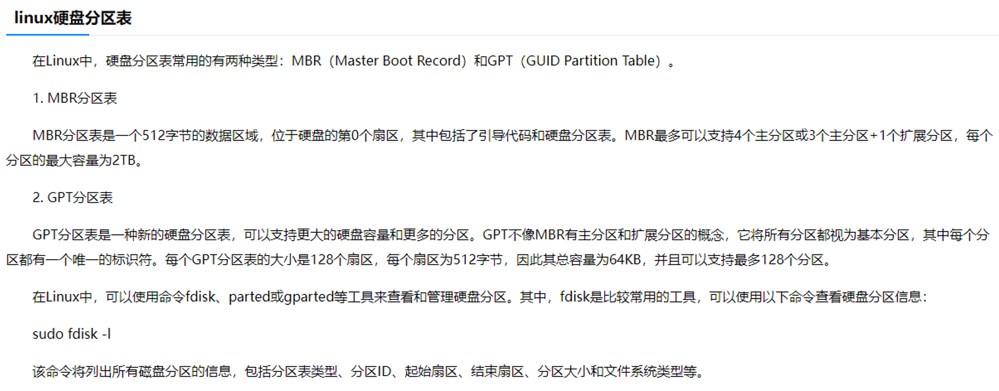

## 硬盘、KVM与dd命令理论与实践

### 一、制作KVM安装了操作系统的小型qcow2硬盘

1. 首先安装Ubuntu，在kvm上给分配一个4G的存储空间(硬盘), 硬盘格式必须要是qcow2
2. 最小化安装，安装服务器版本, 安装时候分配300M到/boot, 其它分给/
3. 安装完成后安装必要的软件，然后关机，
4. 将此虚拟机的硬盘压缩到最小以**便于迁移**: 
    `qemu-img convert -c -O qcow2 $os_disk.qcow2 $os_disk_small.qcow2`
5. qemu-img最佳实践见下一节

### 二、qemu-img压缩理论最佳实践

1. 使用命令`qemu-img convert -c -O qcow2 $os_disk.qcow2 $os_disk_small.qcow2`对虚拟机硬盘进行压缩以便于迁移。
2. 压缩理论: 常见的压缩算法是把文件中连续出现的'\0'字符进行压缩, qemu-img使用同样的原理(据说)，把硬盘里'\0'字符进行压缩。
3. 文件删除理论: 如果虚拟机已经用过很久，那么就算df查看到硬盘的使用量很低，但实际硬盘里面都不是zero字符。因为硬盘某位置写入过后，删除时不会再将该字节置零，而是在inode表里面将**文件记录**删除，这达成了快速删除的效果。这也是有的文件被误删后还有机会将其恢复的原理。
4. 猜想: df查看虚拟机硬盘占用, 把未使用的空间用zero文件几乎写满然后删掉, 进行这样操作之后qemu-img对硬盘文件的压缩率将大大提高。
5. 实践: 
    1. 创建一个用于测试的虚拟机, 其硬盘写入一个随机文件然后删掉
    2. 将其硬盘进行压缩, 查看压缩后的大小
    3. 将该虚拟机写入一个zero文件然后删掉, 这时理论上在虚拟机内df看到的硬盘使用率是一样的, 将其硬盘进行压缩然后查看大小
6. 经过上述实践验证可知从理论推出的猜想是成立的。

### 三、快速迁移环境

1. 把虚拟机硬盘文件尽量压缩小是为了便于迁移和复制, 比如经过大量操作才搭建好的一个环境, 直接复制硬盘文件就可使用。
2. 其它环境迁移方式:
    1. docker
    2. 制作装机iso镜像

### 四、硬盘分区表理论

1. 两种主流硬盘分区类型与扇区所在

2. 实践: 
    1. 起因：某it要给某个kvm虚拟机的硬盘扩展容量，然而扩展过程中忘记 没有把虚拟机关机，导致出现问题
    2. 分析：幸好之前备份过这个虚拟机的整个硬盘，将原始备份硬盘和损坏硬盘挂载到其它虚拟机上，进行对照分析，发现损坏的硬盘大概率只是硬盘分区表损坏了，导致读不到挂载点读不到里面的文件。
    3. 方案1：直接按照MBR或者GPT的分区表大小将原始备份硬盘的对应数据dd到损坏硬盘上，命令`dd if=/dev/vdc of=/dev/vdb bs=512 count=1`   #此处512为MBR分区表大小
    4. 方案2：手动使用fdisk命令来参照原始备份硬盘的内容来配置损坏硬盘的分区表内容，从而能够读到挂载点
    5. 结果：方案1成功了，所以方案2没有尝试
    6. 另外：fdisk也是给kvm虚拟机扩展硬盘时需要用到的命令工具

### 五、Linux硬盘扩容

1. 需要先把原有的硬盘分区删除，再重新手动进行分区

### 五、dd命令

    dd if=/dev/zero of=junk.data bs=1M count=1		#生成大小为1*1M的文件
	#dd：用指定大小的块拷贝一个文件，并在拷贝的同时进行指定的转换
